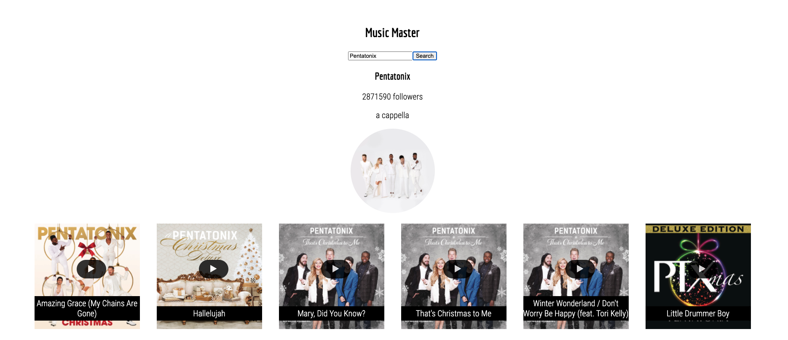

# Music Master

This project was bootstrapped with [Create React App](https://github.com/facebook/create-react-app). The app allows users to search for a music artist of their choice.

## Available Scripts

In the project directory, you can run:
* `npm start` (Runs the app in the development mode)
* `npm test` (Launches the test runner in the interactive watch mode)\

## Screenshots

### Landing Page:

## Summary

In order to gain information about an artist, the user searches the artist within the search input. The results page will display the artist name, their number of followers, their genre, an image, and a list of some of their songs that you can sample.

## Built With

* HTML
* CSS
* JavaScript
* jQuery
* React
